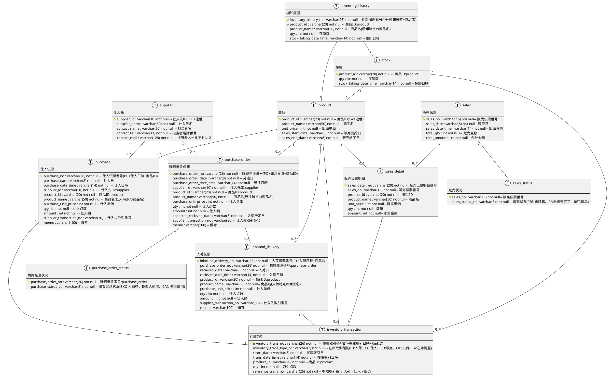

# 次世代開発コースA 店舗業務デジタル化・モバイル化 データモデル

## 利用方法

* 本資料はLevel1店舗業務のデジタル化、Level2店舗業務のモバイル化時点までのデータモデルのサンプルである。
* 当初の目的を果たすことができればデータモデルは下記に従う必要なない。
* VS CodeにてPlant UMLでモデリングを実施したあと、同じフォルダにある`plantuml2mysql.py`を利用し、MySQLのテーブル生成用DDLを作成できる。`./plantuml2mysql DataModel.md flower_db`を実行する。

---

## データ要件

### 1. 仕入先と商品

* 仕入先は花き市場で花の種類や季節により仕入先が異なるが、現時点では仕入先を識別する意味が少ないとのことにて花き市場「東京フラワーポート」のみを登録する。
* 花の種類は要件にもあるようにバリエーションごとのSKUは扱わないためシンプルに商品IDと販売単価を管理
* 商品は販売開始終了を項目として保持するが将来拡張用のためであり当初は利用しない。

### 2. 在庫の扱い

* 在庫は直近の棚卸時点の商品別の在庫数を定点の在庫として保持する。
* 在庫の移動は在庫取引として在庫の増減と発生理由を保持する。
* 現在の在庫数は前回棚卸し時点の在庫に前回棚卸し時点からの在庫取引の増減を加味して算定する
* 棚卸の履歴は将来必要に応じて在庫とは別に履歴を保持する。
* 現在は取引数が少ないことから現在在庫数を照会する際に都度前回棚卸しの在庫数と以後の在庫取引で在庫計算をするが、将来取引数が増加した場合は都度計算した在庫数を保持することも検討する。

### 3. 発注・入荷・仕入の扱い

* 発注できる商品は取り扱い商品となっている商品のみ。仕入先も取引先として管理されている仕入先に対してのみ発注できる。
* 発注状況は発注伝票と別管理にするが必ず１：１で存在することを保証する。
* １回の発注に対して入荷も１回とする。分納の場合は発注も別途起票する。
* 発注取消となった場合は入荷は存在しない。
* 仕入先に入荷後返品する場合は発注数を減らし入荷数を減らすように起票する。
* 仕入先に入荷後返品する場合は現在の在庫数を超えて返品はできない。
* 入荷が完了した発注は変更できない。必ず入荷を取消してから発注を変更するため発注と入荷の内容は必ず一致する。
* 入荷時に仕入単価や点数が変更になった場合は入荷と同時に発注にも変更が反映される。
* 入荷時は入荷点数分を入庫して在庫を増やす。
* 仕入先への返品時は別途発注数、入荷数を減らす伝票を起票し、返品数を出庫して在庫を減らす。
* 入荷を取り消した場合は入庫数を減らし在庫を減らす。（出庫扱いにしない。）
* 仕入できる商品は取り扱い商品となっている商品のみ。仕入先も取引先として管理されている仕入先に対してのみ発注できる。
* 仕入時に仕入点数分を入庫することで在庫を仕入点数分増やす。
* 仕入を取り消す場合は入庫も取り消すことで在庫を減らす。（出庫扱いにしない。）

### 4. 販売の扱い

* 販売できる商品は取り扱い商品となっている商品のみ。
* 商品の現在の在庫数を超えて販売することはできない。（Level2の現時点では入荷予定は加味した販売はできない）
* 販売状況は別のテーブルで管理するが必ず１：１で存在することを保証する。
* 販売と連動して出庫することで販売点数分在庫を減らす。
* 返品時は返品点数分を入庫して在庫を増やす。

---

## データモデル

