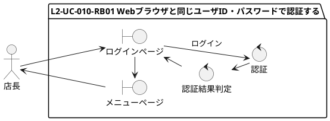
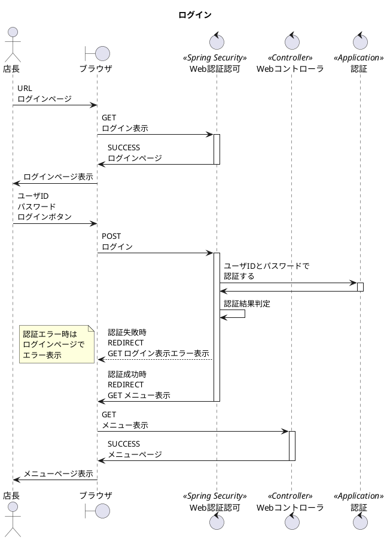
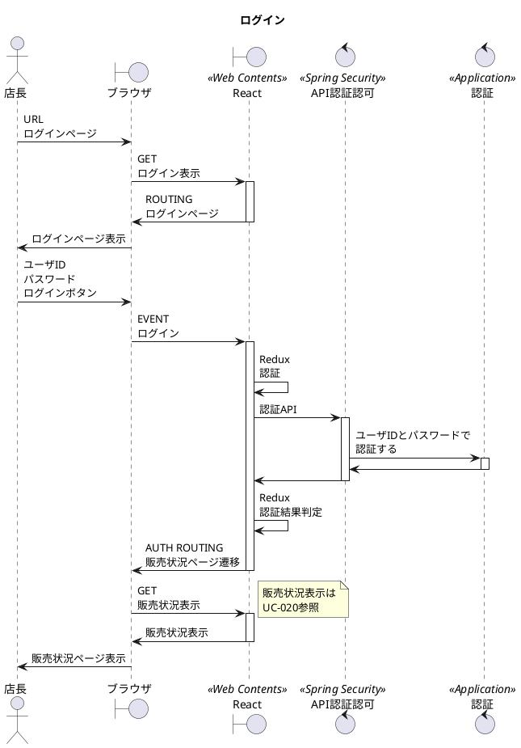

# 次世代開発コースA Level1 店舗業務デジタル化 Level2 モバイル化

## 1. ユースケース・要件

### 【Level1】 L1-UC-010 WebブラウザでユーザID・パスワードで認証する

* L2-UC-010-R-010 私(店長)しか使わないので固定のユーザIDとパスワードで認証ができれば良い。
* L2-UC-010-R-020 当面アルバイトも雇える余力はないので扱えるユーザは追加できなくて良い。
  
### 【Level2】 L2-UC-010 Webブラウザと同じユーザID・パスワードで認証する

* L2-UC-010-R-010 スマートフォンからもWebブラウザと同様にサーバサイドでのユーザIDとパスワードで良い。
* L2-UC-010-R-020 店長だけでクローズドのWIFIで利用すること、そこまでセキュアな情報がシステム内にはないことから、多要素認証や端末認証までは不要。

## 2. モデリング

### 2.1. ロバストネス分析

### 2.2. シーケンス分析(ブラウザ)

### 2.3. シーケンス分析(モバイル)

