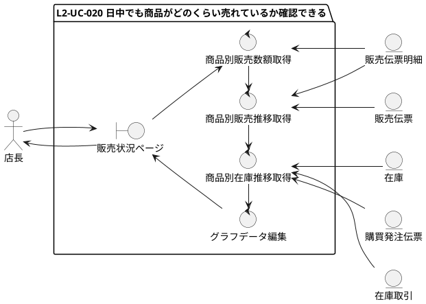
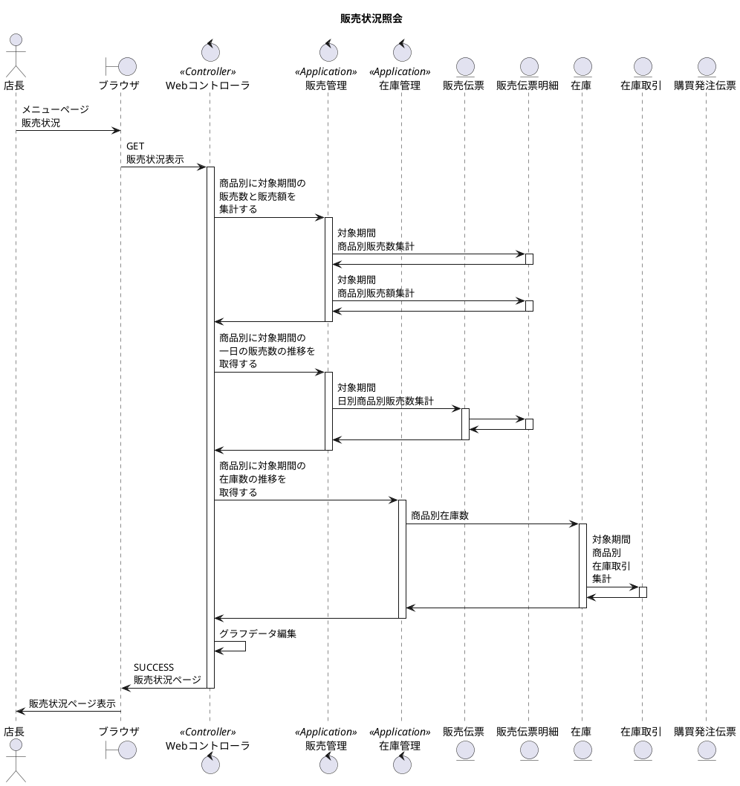
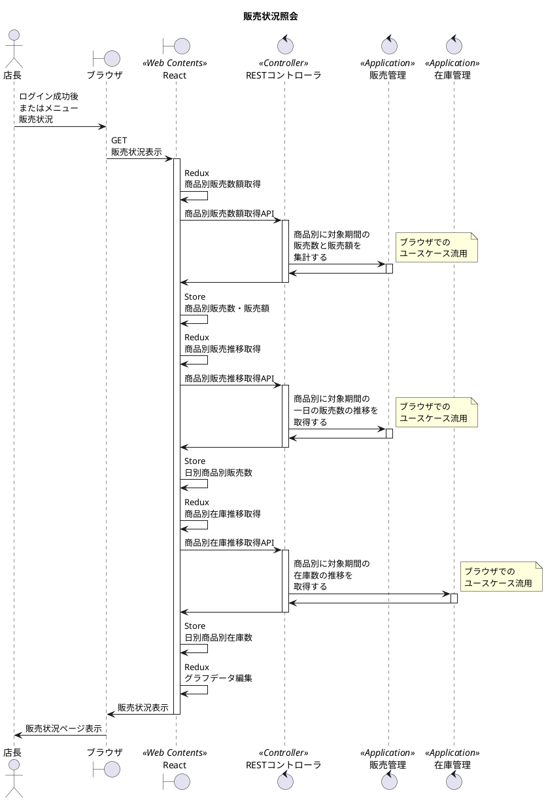

# 次世代開発コースA Level1 店舗業務デジタル化 Level2 モバイル化

## 1. ユースケース・要件

### 【Level1】 L1-UC-020 閉店後に商品ごとに販売数と在庫数の推移が確認できる

* L1-UC-020-R010 商品ごとに直近１ヶ月の販売点数と日別に商品ごとの販売数の推移が可視化できるようにする。
* L1-UC-020-R020 商品ごとに直近１ヶ月の在庫数の推移を見れるようにし翌日以降いついくつ発注すべきか判断する際の参考にする。
  
### 【Level2】 L2-UC-020 日中でも商品がどのくらい売れているか確認できる

* L2-UC-020-R010 商品ごとに過去１ヶ月の販売点数と日別に商品ごとの販売数の推移が円グラフと折れ線グラフで可視化できるようにする。
* L2-UC-020-R020 折れ線グラフでは、将来、発注、納品、販売から計算された在庫の推移も重ねて見れるようにする。【優先度低】

## 2. モデリング

### 2.1. ロバストネス分析

### 2.2. シーケンス分析(ブラウザ)

### 2.3. シーケンス分析(モバイル)

