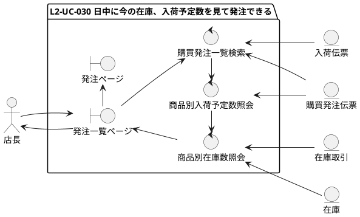
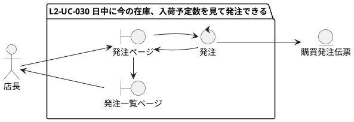
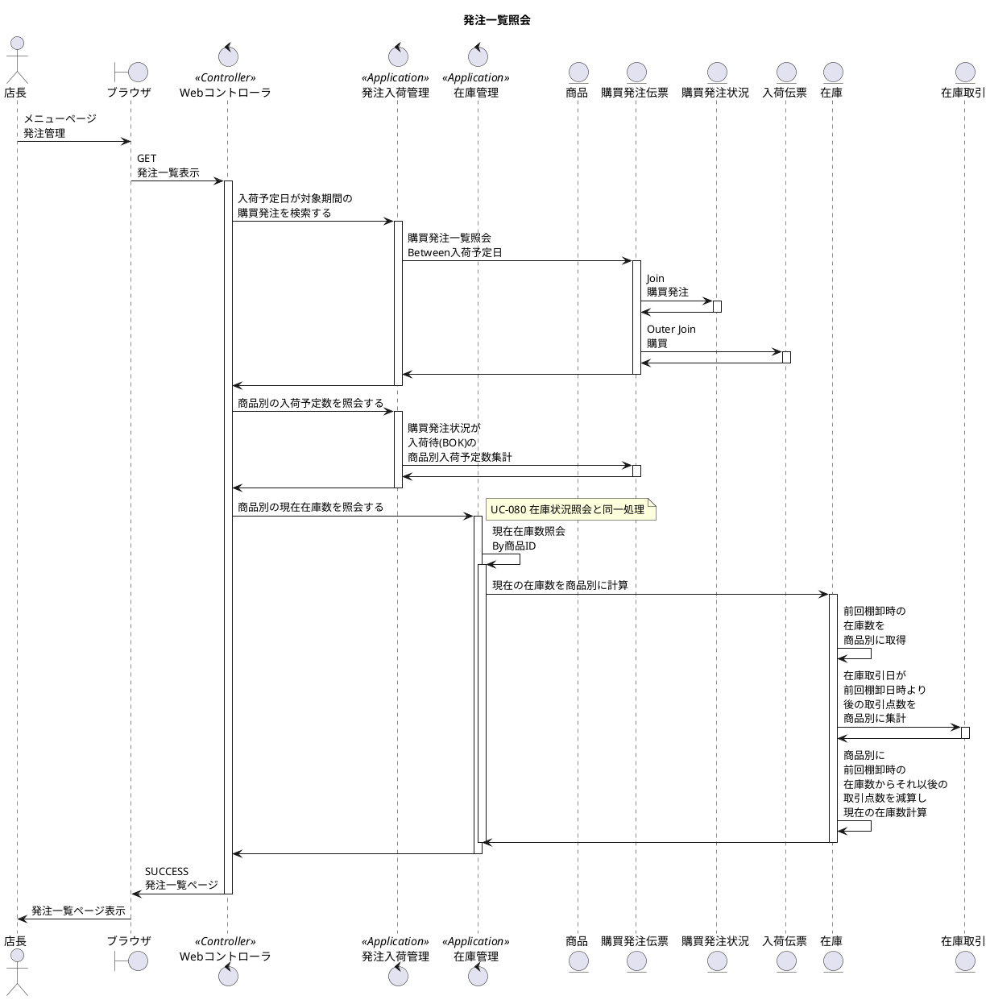
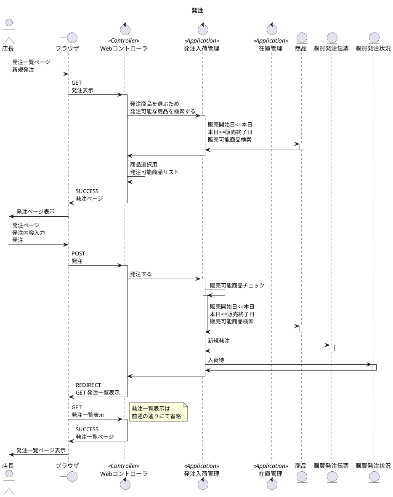
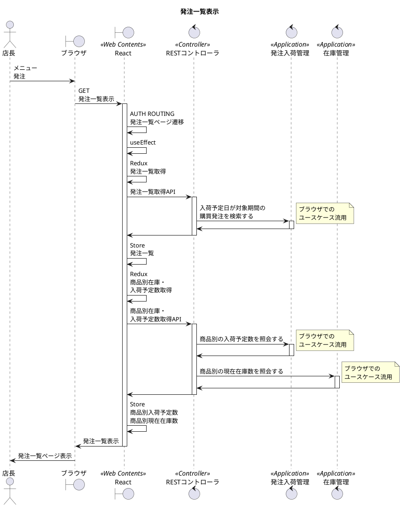
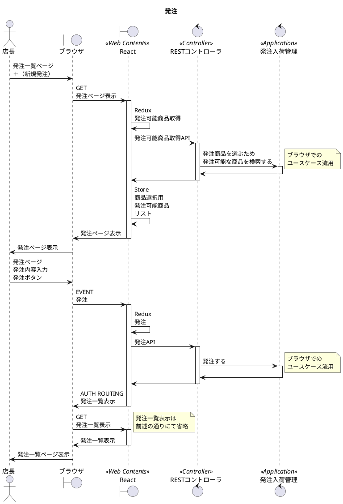

# 次世代開発コースA Level1 店舗業務デジタル化 Level2 モバイル化

## 1. ユースケース・要件

### 【Level1】 L1-UC-030 閉店後に今の在庫、入荷予定数を見て翌日締め切り分の発注できる

* L1-UC-030-R010 未納の発注を発注一覧で確認できるようにする。
* L1-UC-030-R020 発注一覧で一番上に今の商品別の在庫数と未納の納品予定数の合計を確認できる。
* L1-UC-030-R030 発注は商品別に記録できれば良い。商品別に取次先と調整した発注数、仕入価格と納入予定日を記録する。
* L1-UC-030-R040 花屋で管理する発注番号は取次先、商品、発注日単位に発番して管理する。
* L1-UC-030-R050 取次先の取引番号は取次先取引番号として発注に記録できるようにする。取次先取引番号は20桁あれば足りる。

### 【Level2】 L2-UC-030 日中に今の在庫、入荷予定数を見て当日締め切り分の発注に間に合わせることができる

* L2-UC-030-R010 未納の発注を発注一覧で確認できるようにする。
* L2-UC-030-R020 発注一覧で一番上に今の商品別の在庫数と未納の納品予定数の合計を確認できる。
* L2-UC-030-R030 発注は商品別に記録できれば良い。商品別に取次先と調整した発注数、仕入価格と納入予定日を記録する。
* L2-UC-030-R040 花屋で管理する発注番号は取次先、商品、発注日単位に発番して管理する。
* L2-UC-030-R050 取次先の取引番号は取次先取引番号として発注に記録できるようにする。取次先取引番号は20桁あれば足りる。

## 2. モデリング

### 2.1. ロバストネス分析

### 2.2. シーケンス分析(ブラウザ)

### 2.3. シーケンス分析(モバイル)

