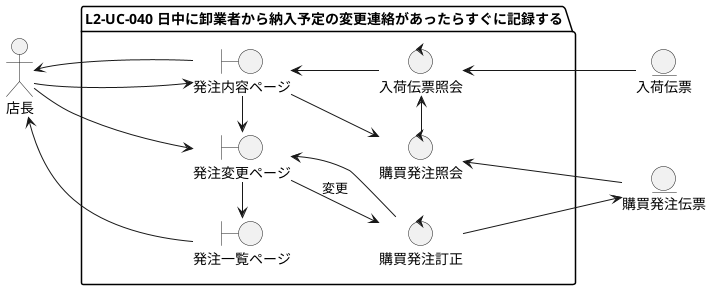
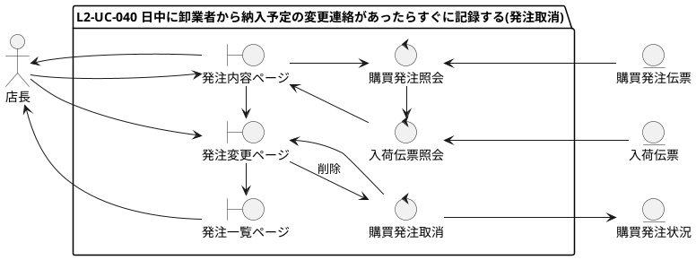
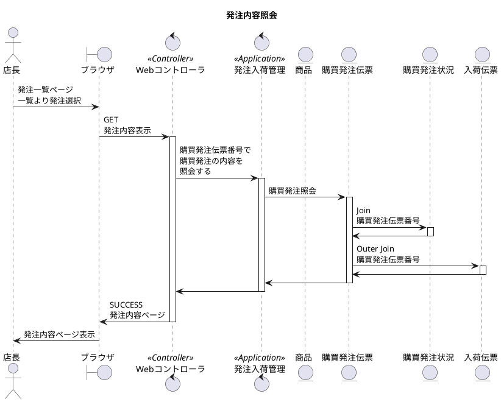
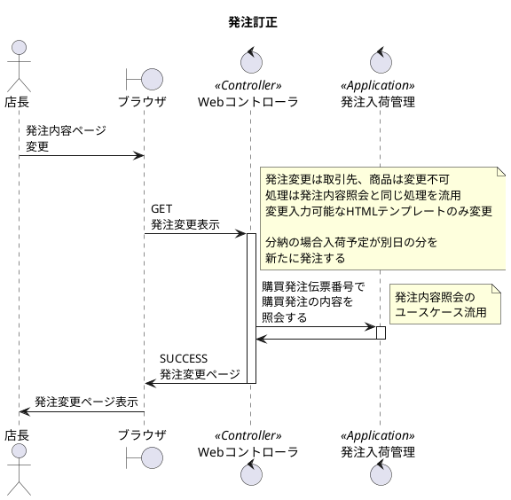
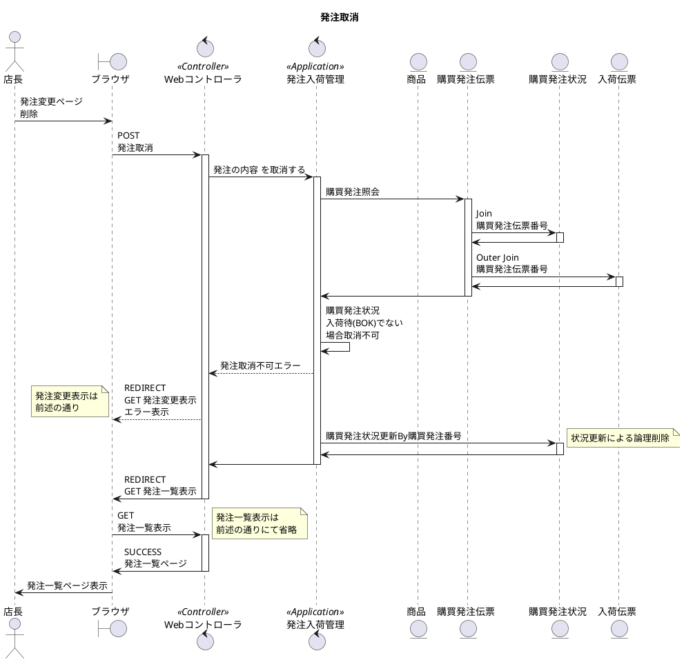
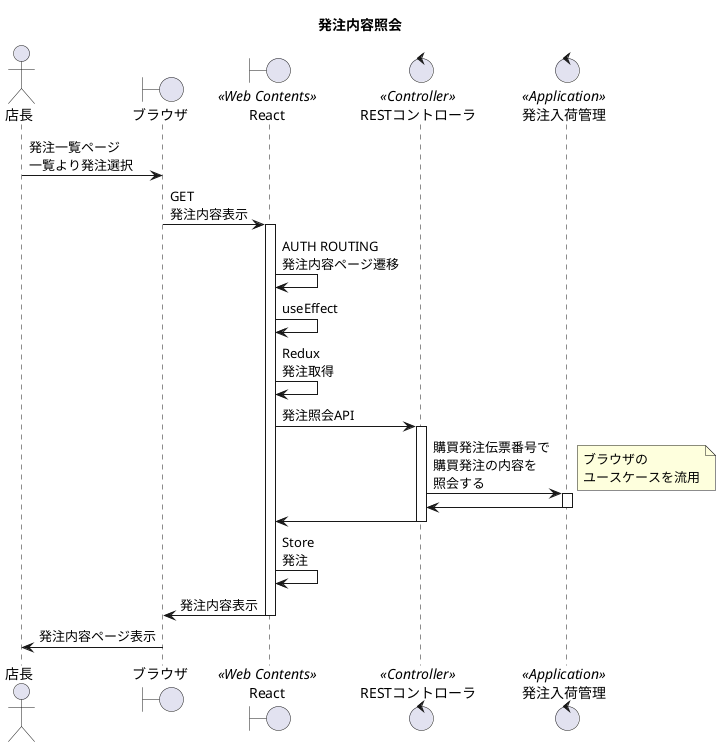
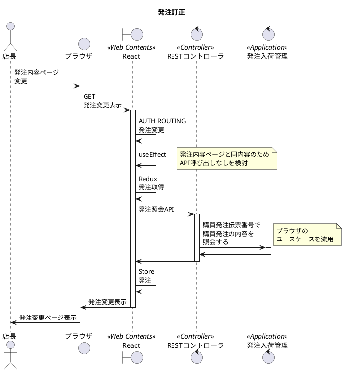
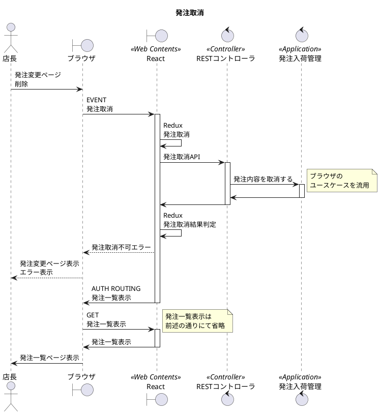

# 次世代開発コースA Level1 店舗業務デジタル化 Level2 モバイル化

## 1. ユースケース・要件

### 【Level1】 L1-UC-040 閉店後に日中連絡があった卸業者からの納入予定の変更を記録する

* L1-UC-040-R010 取次先から発注に対して、発注番号ごとに納入予定日、仕入数、仕入価格を変更できる。
* L1-UC-040-R020 発注の変更一覧は残さない。最新の発注だけ記録する。
* L1-UC-040-R030 納入予定が複数回に分かれる場合は１つの発注で管理せず発注を分けて管理する。
* L1-UC-040-R040 内部の発注番号と別に取次先の管理番号を記録できるようにする。

### 【Level2】 L2-UC-040 日中に卸業者から納入予定の変更連絡があったらすぐに記録する

* L2-UC-040-R010 取次先から発注に対して、発注番号ごとに納入予定日、仕入数、仕入価格を変更できる。
* L2-UC-040-R020 発注の変更一覧は残さない。最新の発注だけ記録する。
* L2-UC-040-R030 納入予定が複数回に分かれる場合は１つの発注で管理せず発注を分けて管理する。
* L2-UC-040-R040 内部の発注番号と別に取次先の管理番号を記録できるようにする。

## 2. モデリング

### 2.1. ロバストネス分析

### 2.2. シーケンス分析(ブラウザ)

### 2.3. シーケンス分析(モバイル)

