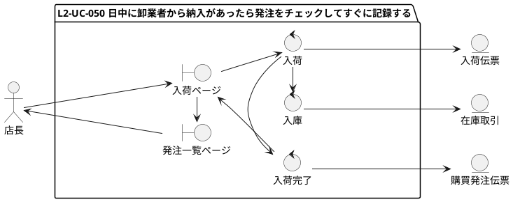
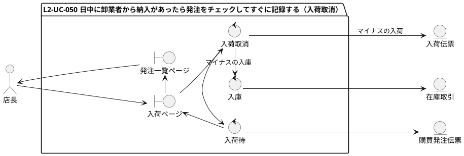
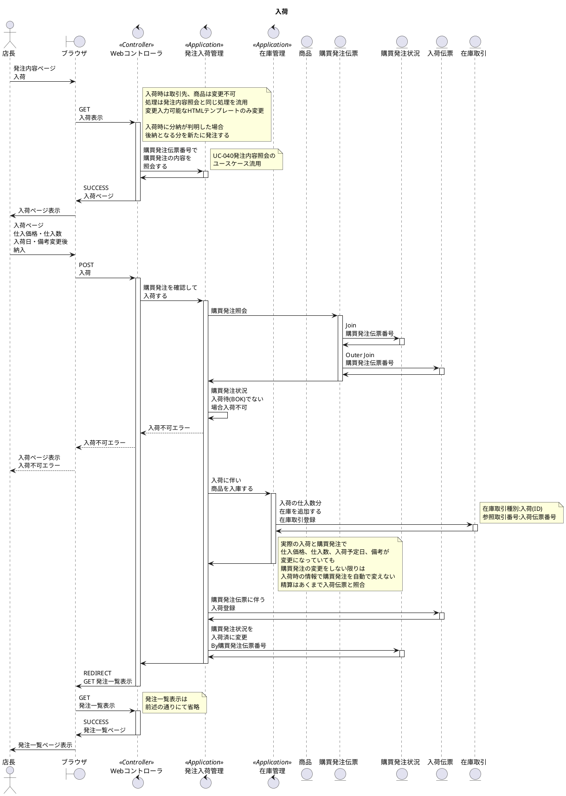
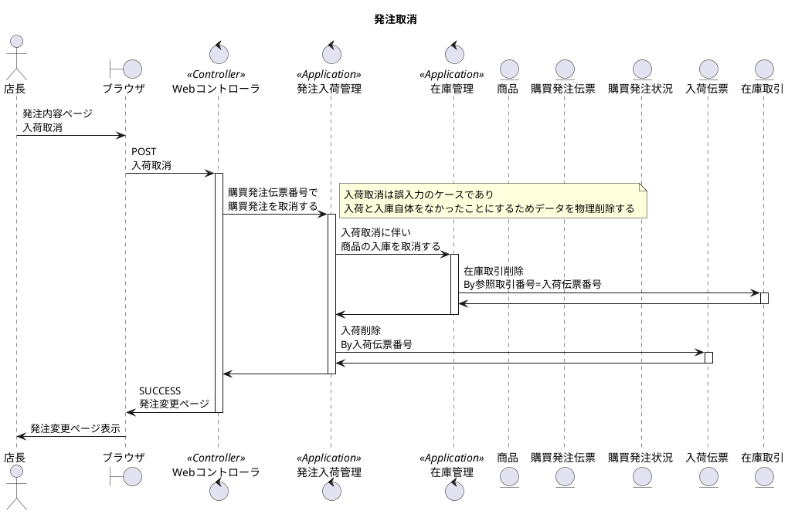
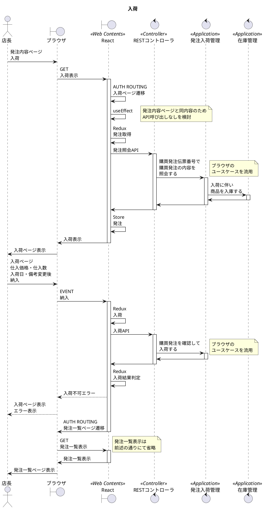
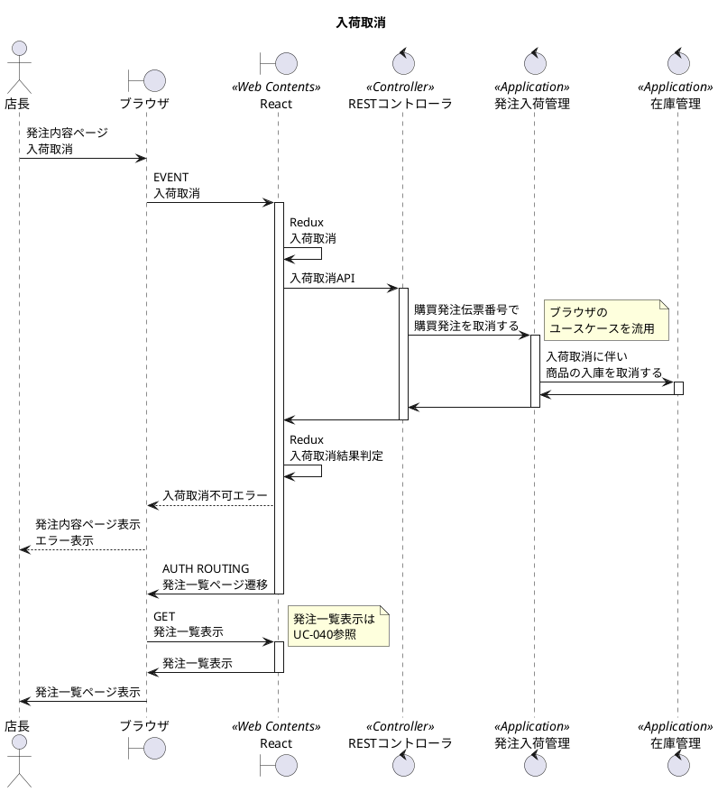

# 次世代開発コースA Level1 店舗業務デジタル化 Level2 モバイル化

## 1. ユースケース・要件

### 【Level1】 L1-UC-050 閉店後に日中納入された商品を記録する

* L1-UC-050-R010 日中納品された商品は納品書と発注を照合して納入を記録できるようにする。
* L1-UC-050-R020 納品書の納入数と発注時の数と合わないときに発注の数を訂正し理由も記録できる。
  
### 【Level2】 L2-UC-050 日中に卸業者から納入があったら発注をチェックしてすぐに記録する

* L2-UC-050-R010 日中の納品は発注と照合してすぐに納入を記録できるようにする。
* L2-UC-050-R020 実際納入された数と発注時の数と合わないときに発注の数を訂正し理由も記録できる。

## 2. モデリング

### 2.1. ロバストネス分析

### 2.2. シーケンス分析(ブラウザ)

### 2.3. シーケンス分析(モバイル)

