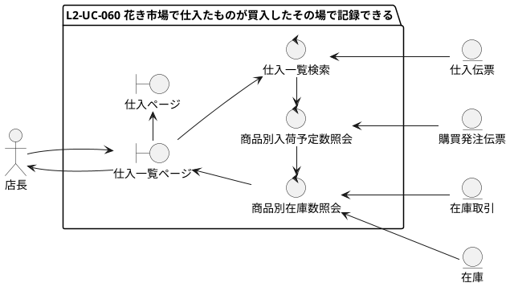
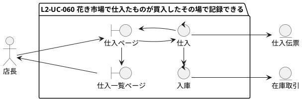
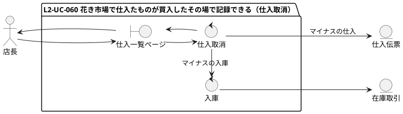
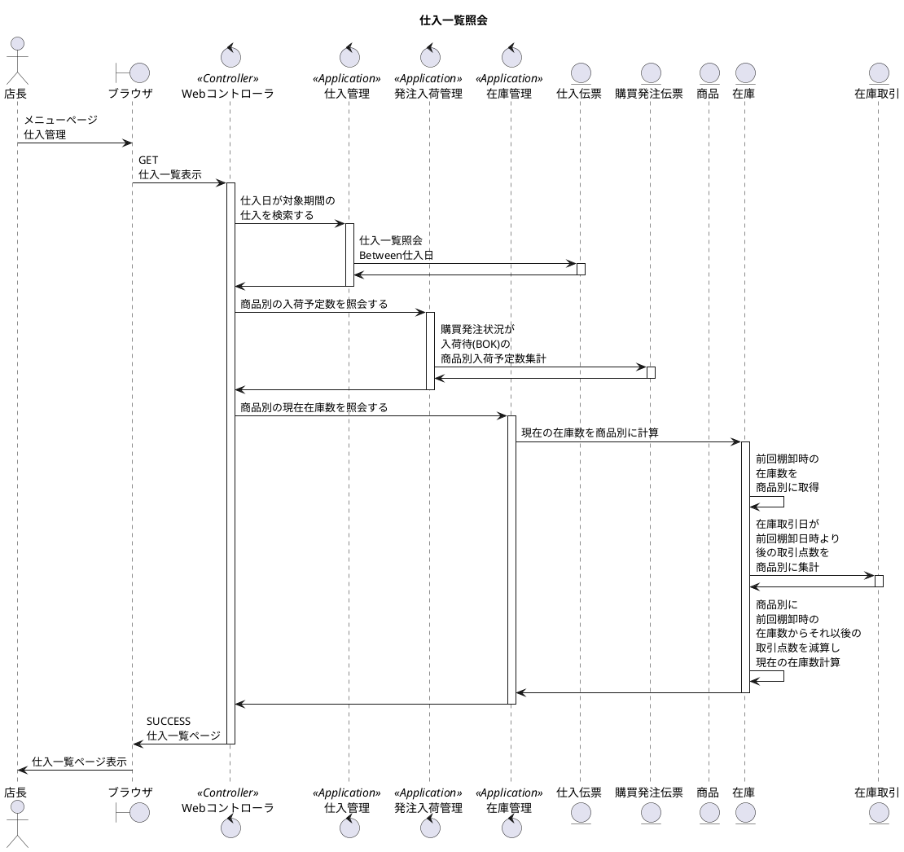
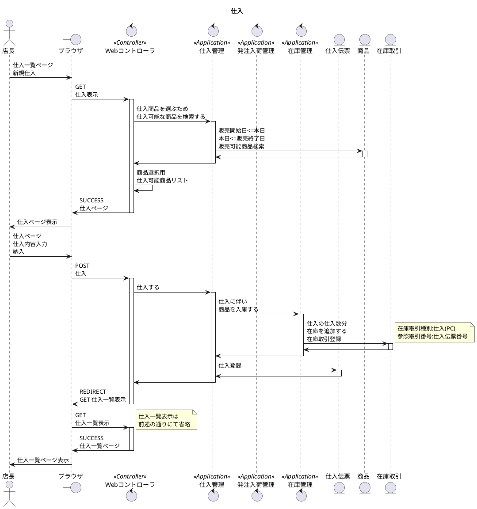
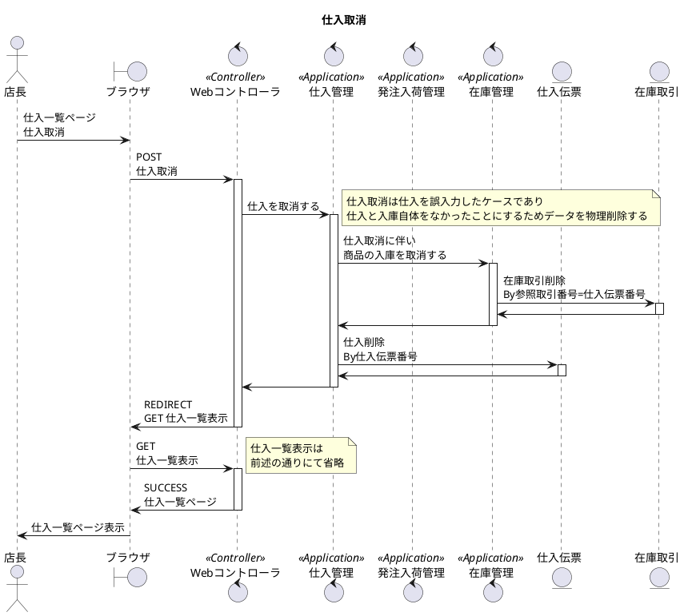
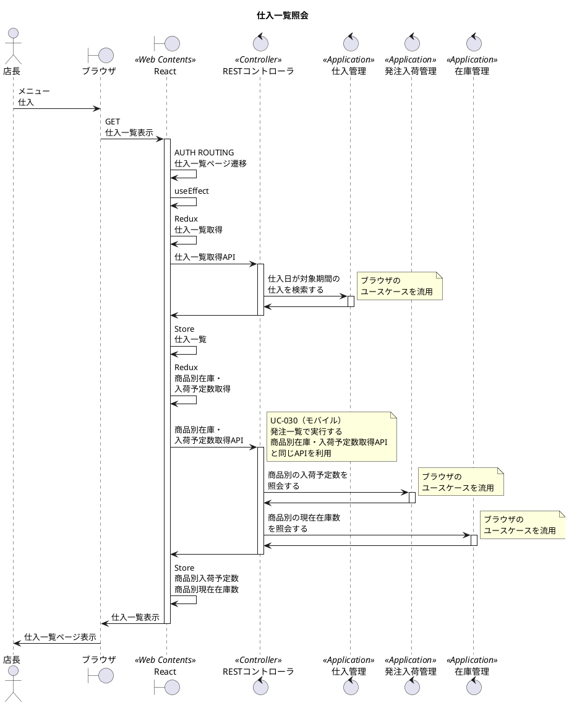
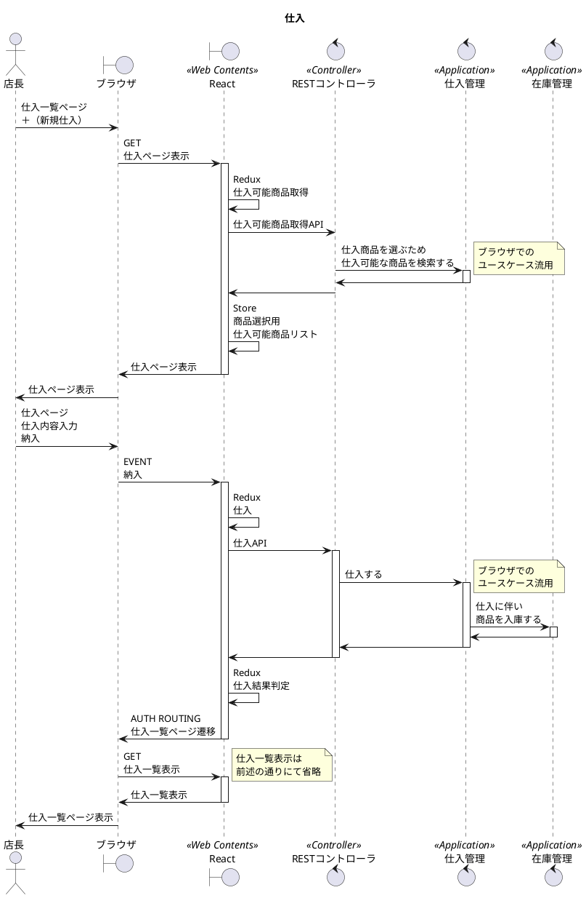
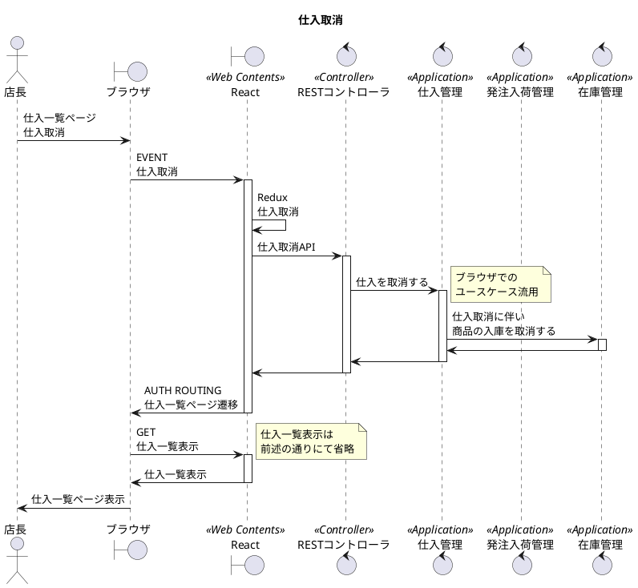

# 次世代開発コースA Level1 店舗業務デジタル化 Level2 モバイル化

## 1. ユースケース・要件

### 【Level1】 L1-UC-060 花き市場で仕入たものを閉店後に記録できる

* L1-UC-060-R010 早朝の仕入で仲卸業者から買入した商品、仕入数、仕入価格を閉店後記録する。仕入数は在庫計上する。
* L1-UC-060-R020 仕入の記録は一通り入力したあとに紙と照合できるように一覧で表示する。
* L1-UC-060-R030 仕入一覧で一番上に今の商品別の在庫数と未納の納品予定数の合計を確認できる。

### 【Level2】 L2-UC-060 花き市場で仕入たものが買入したその場で記録できる

* L2-UC-060-R010 早朝の仕入で仲卸業者から買入した商品、仕入数、仕入価格を記録できる。仕入数はすぐに在庫計上する。
* L2-UC-060-R020 仕入の記録はきちんと入れたか確認するため一覧で表示して欲しい。
* L2-UC-060-R030 仕入一覧で一番上に今の商品別の在庫数と未納の納品予定数の合計を確認できる。

## 2. モデリング

### 2.1. ロバストネス分析

### 2.2. シーケンス分析(ブラウザ)

### 2.3. シーケンス分析(モバイル)

