# 次世代開発コースA Level1 店舗業務デジタル化 Level2 モバイル化

## 1. ユースケース・要件

### 【Level1】 L1-UC-070 閉店後に販売を記録できる

* L1-UC-070-R010 お客様の購入した商品が何で、一ついくらで、いくつ購入していくらの販売額になり在庫がいくつ減ったかを記録できるようにしたい。
* L1-UC-070-R020 値引きは単価でしか値引きしない。総額似たしする値引きはしていない。
* L1-UC-070-R030 購入商品を選ぶ時は今扱っている3種類の商品から選べれば良い。
* L1-UC-070-R040 商品の販売単価を販売ごとに変えられる。一度の販売で商品につき一つの販売単価だけ扱えれば良い。
* L1-UC-070-R050 商品を間違って選んでしまったときのために商品単位で購入対象から除外できるようにする。販売数を間違えたときは一度商品を除外してから再度商品を選び直す。
* L1-UC-070-R060 誤って販売を登録したときのために販売ごと削除できるようにする。

### 【Level2】 L2-UC-070 接客しながら販売の記録と精算や釣銭計算ができる

* L2-UC-070-R010 お客様と接客しながらお客様の購入予定の商品が何で、一ついくらで、いくつ購入するかを記録すると請求額を計算できるようにしたい。
* L2-UC-070-R020 お客様からの預かり金を入れるとお釣りも計算できるようにしたい。
* L2-UC-070-R030 購入商品を選ぶ時は今扱っている3種類の商品からさっと選べると良い。
* L2-UC-070-R040 商品の販売単価を販売ごとに変えられる。一度の販売で商品につき一つの販売単価だけ扱えれば良い。値引きも同じ商品であれば同じ値引きを適用する。
* L2-UC-070-R050 お客様が購入する花を変えるときのために商品単位で購入対象から除外できるようにする。めったにない購入予定の花を減らす機能はあってもなくてもよい。
* L2-UC-070-R060 花をアレンジせず購入直後であれば返品を受け付けて返金する。花をアレンジしているかは見ればわかるので特に管理はいらないが戻した商品の在庫がわかるようにする。
  
## 2. モデリング

### 2.1. ロバストネス分析

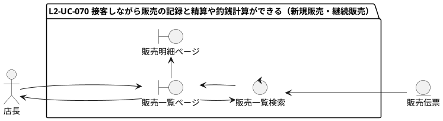

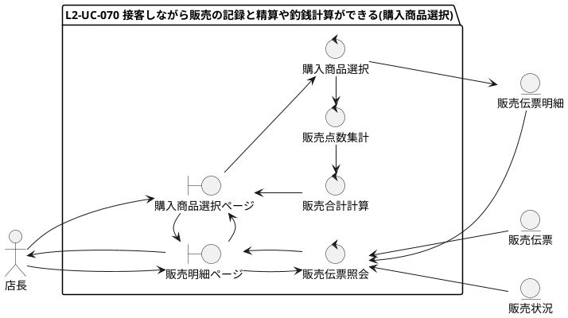

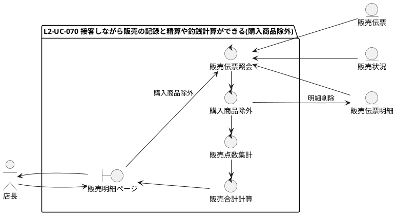

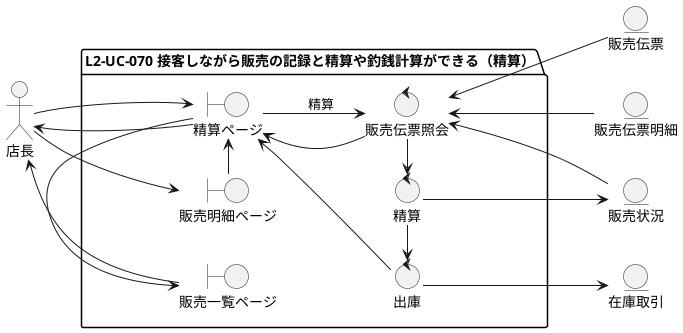

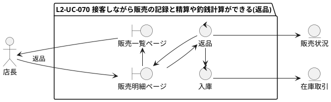

### 2.2. シーケンス分析(ブラウザ)

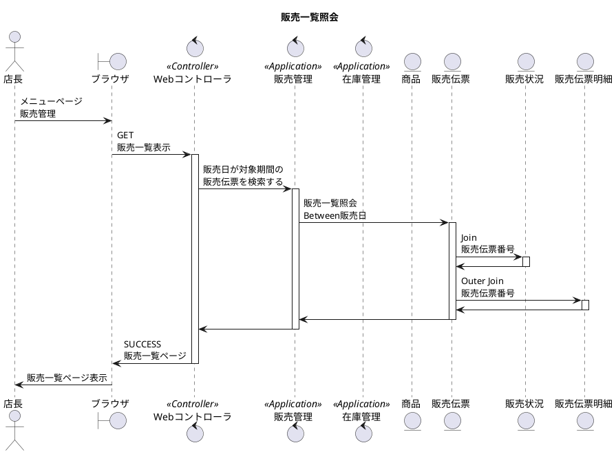

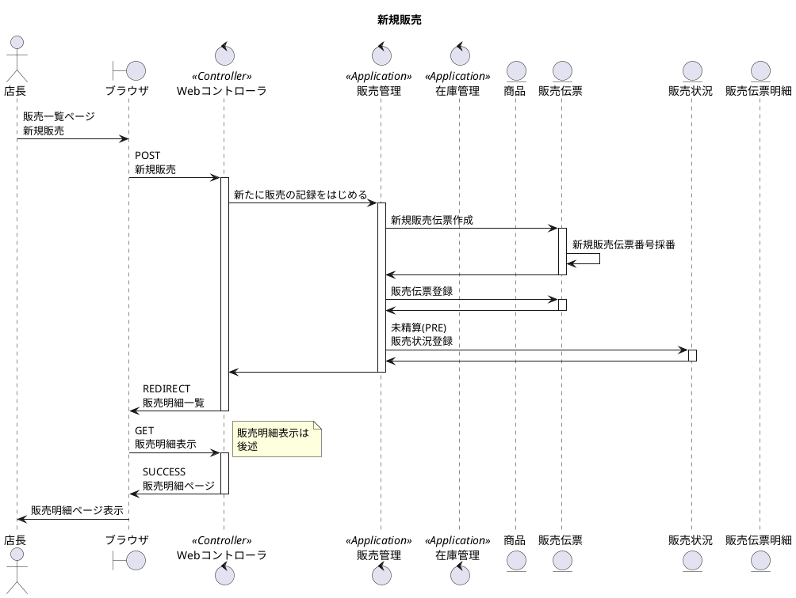

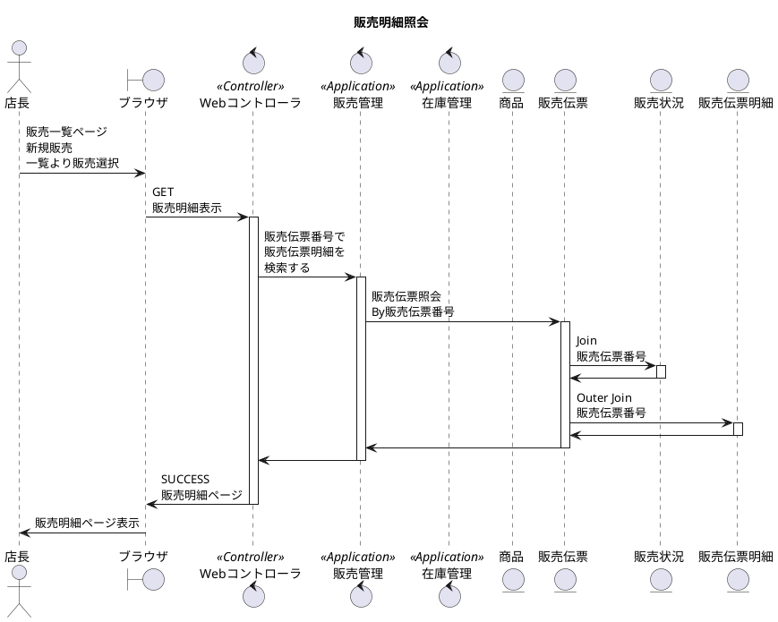

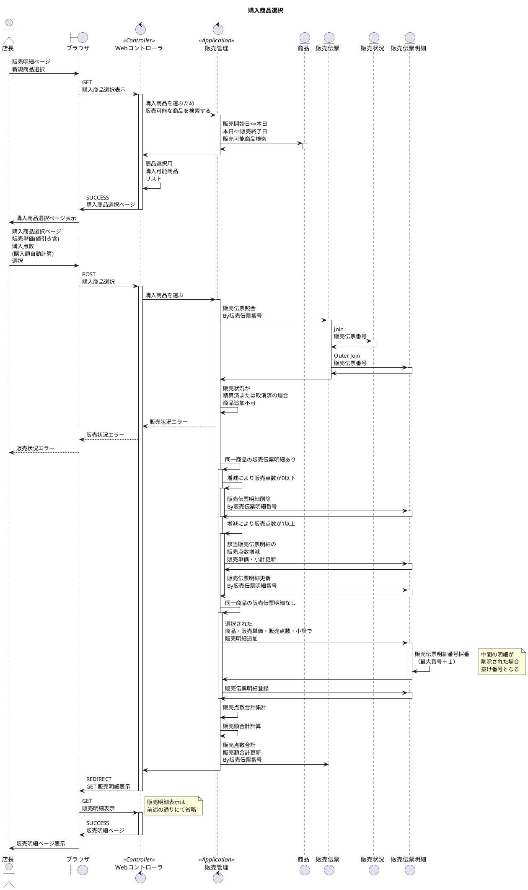

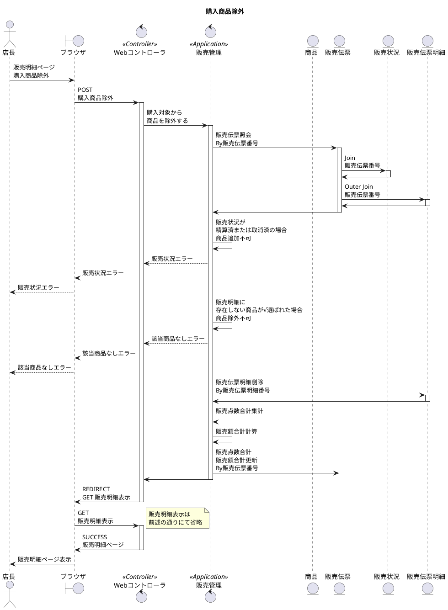

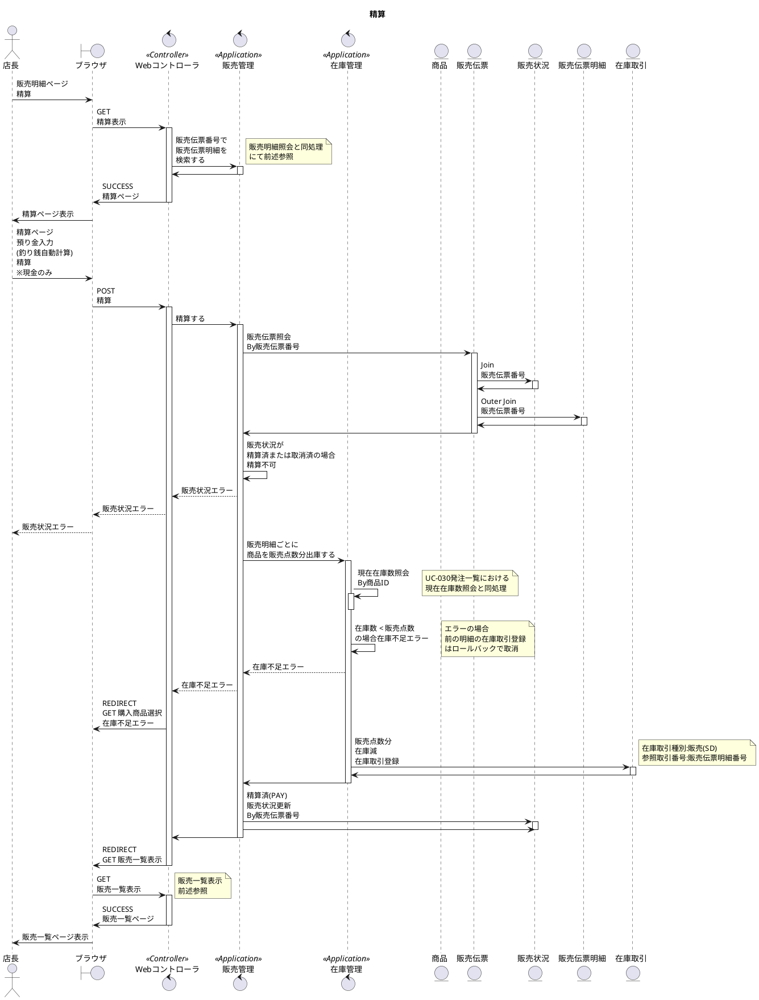

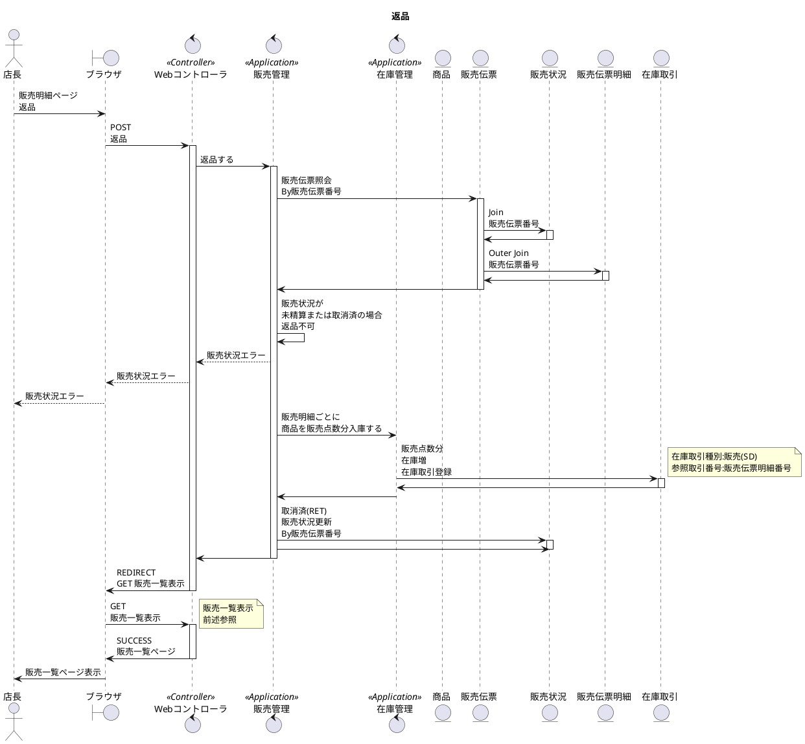

### 2.3. シーケンス分析(モバイル)

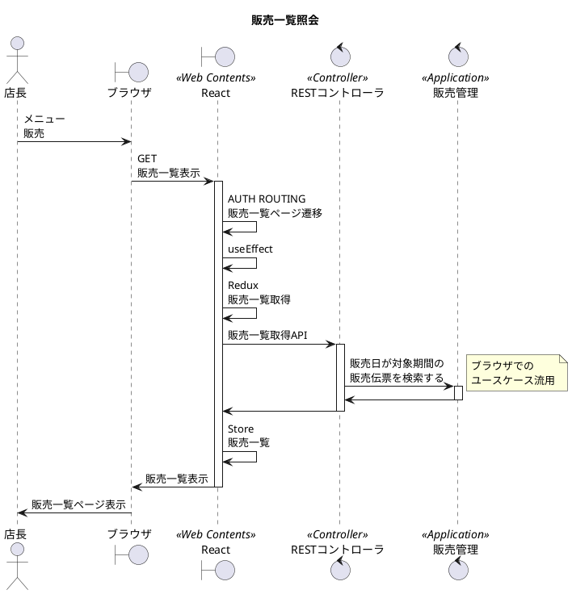

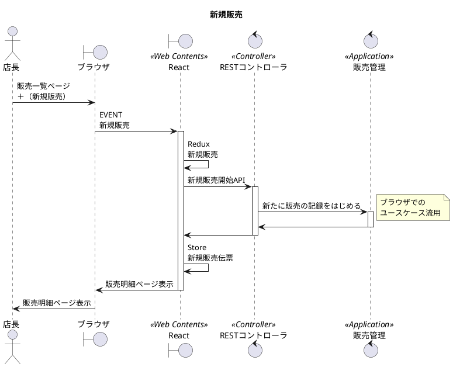

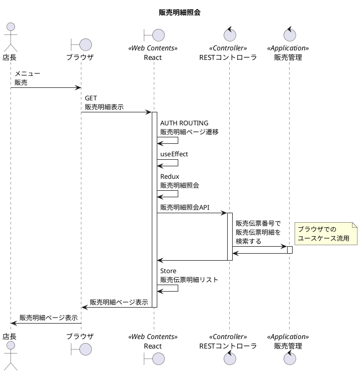

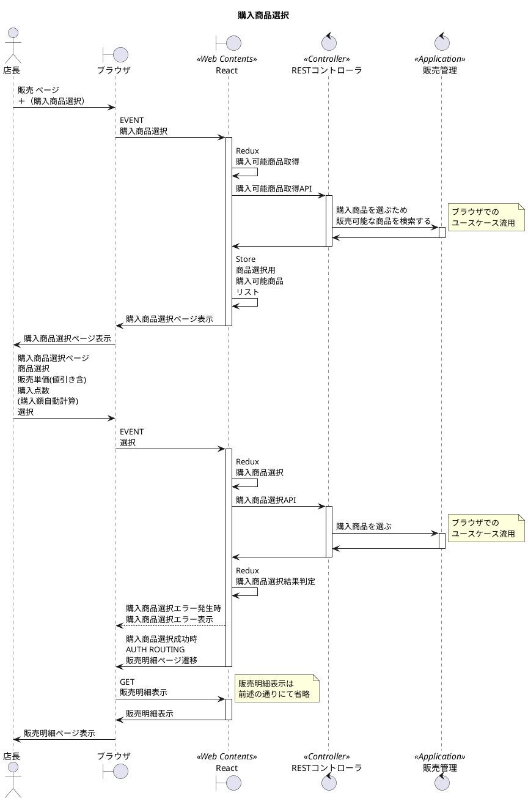

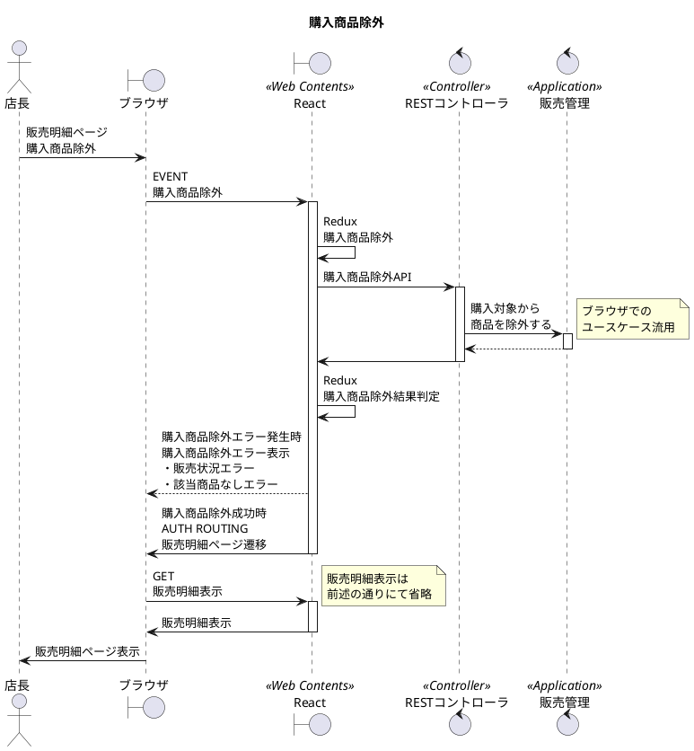

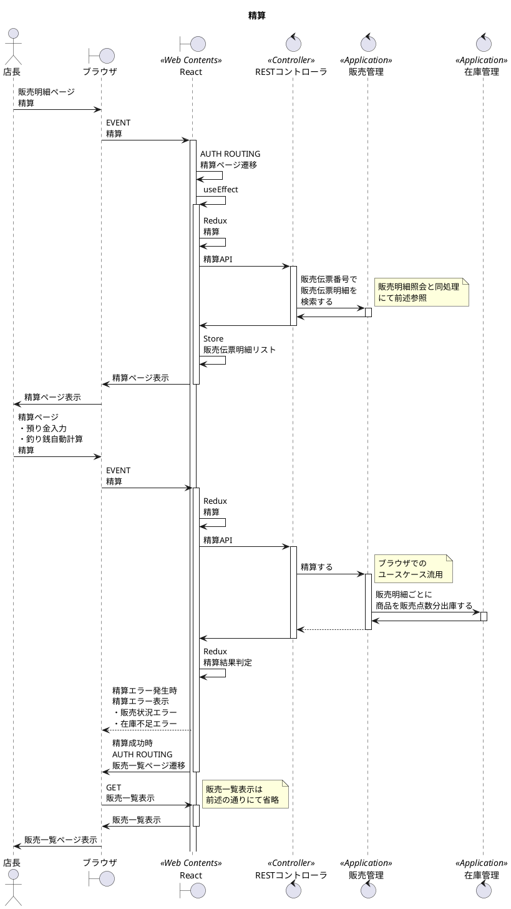

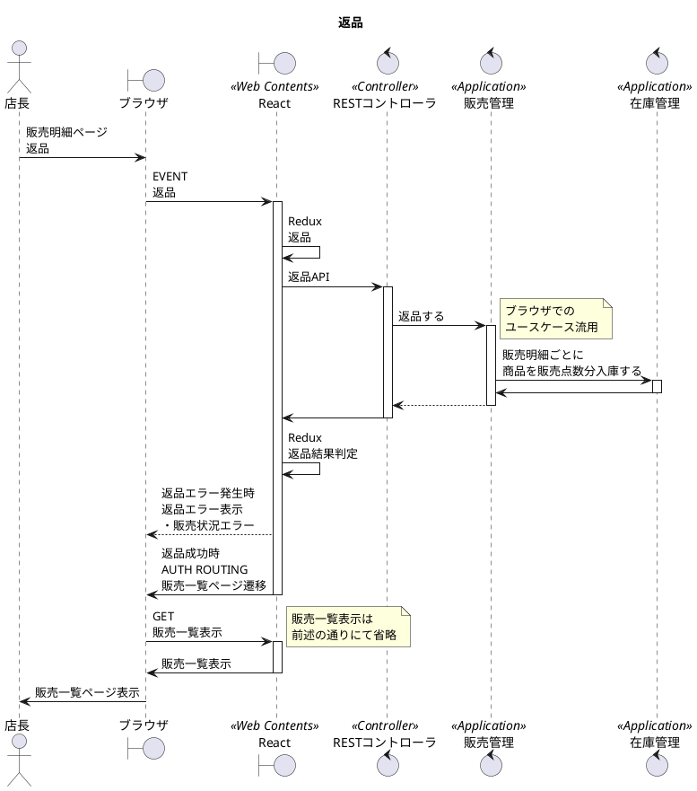
