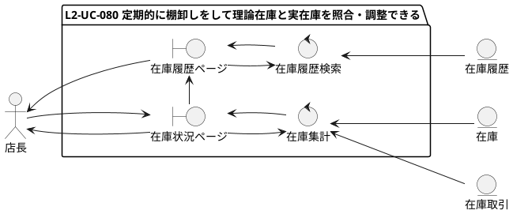
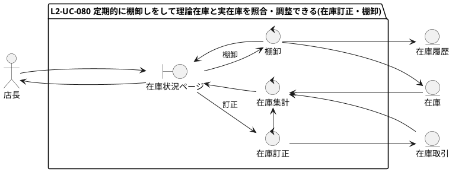
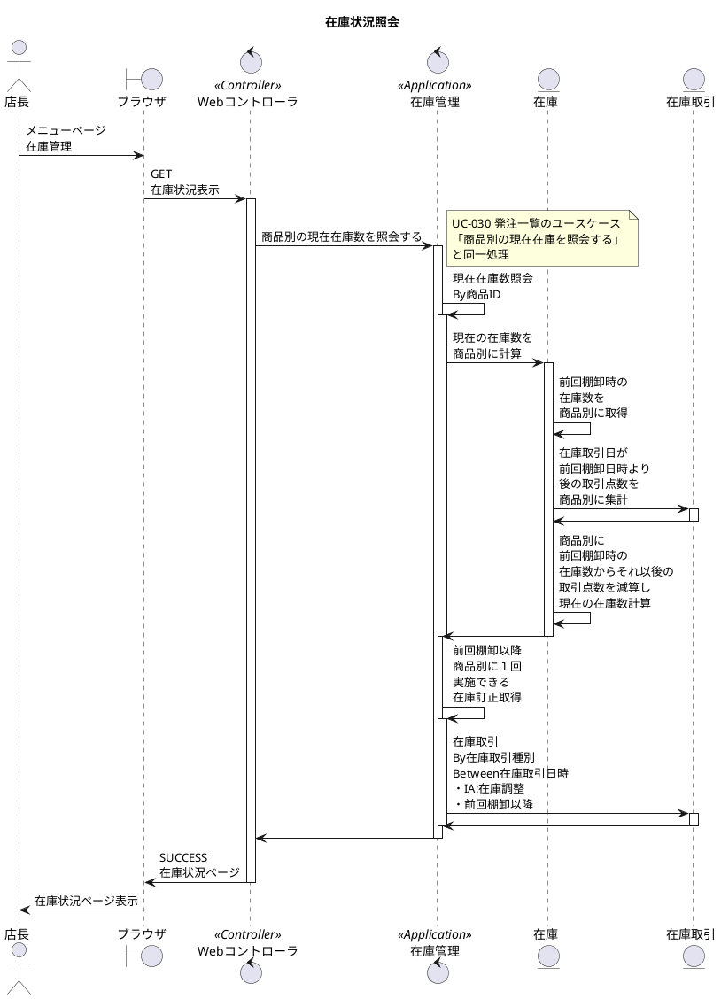
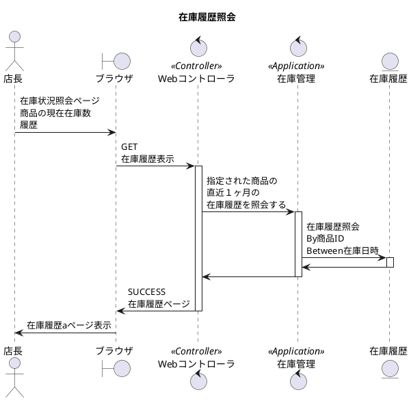
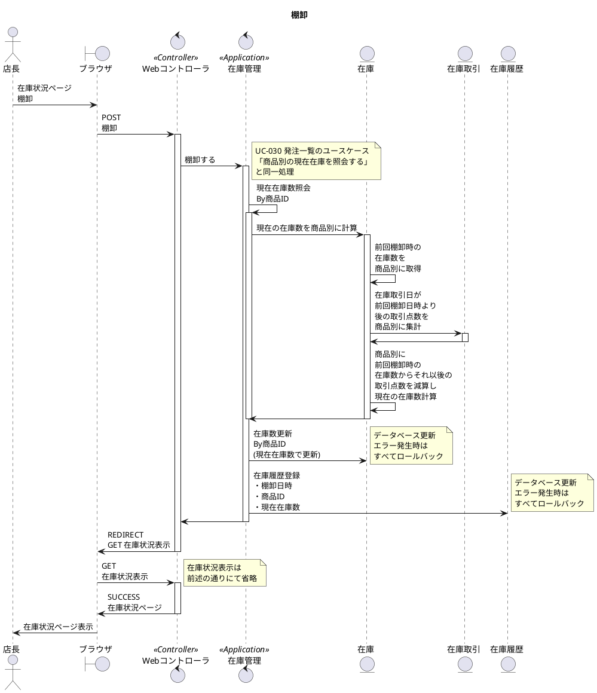
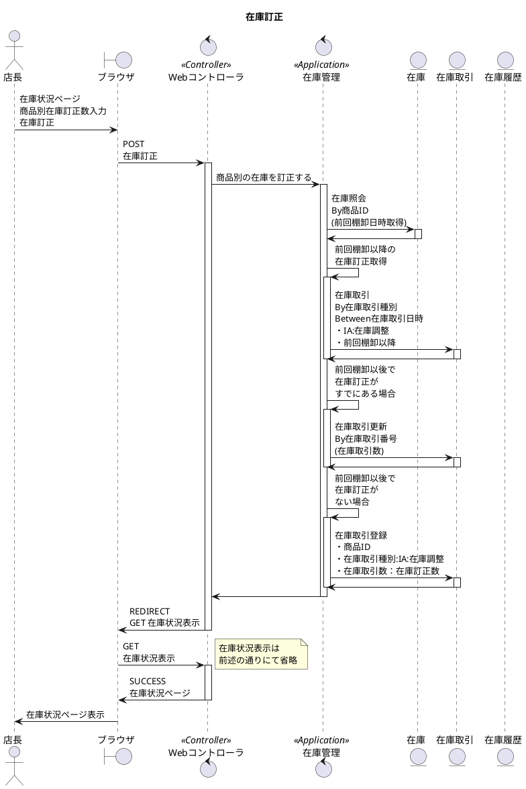

# 次世代開発コースA Level1 店舗業務デジタル化 Level2 モバイル化

## 1. ユースケース・要件

### 【Level1】 L1-UC-080 定期的に棚卸しをして理論在庫と実在庫を照合・調整できる

* L1-UC-080-R010 前回棚卸時に記録した在庫数と納入、仕入、販売による入出庫による在庫数の増減が計算され現在の商品別の理論在庫を確認できる。
* L1-UC-080-R020 理論在庫と実在庫に差異があり、過去の納入、仕入、販売を訂正できない場合は、在庫訂正を記録して在庫数を調整できる。
* L1-UC-080-R030 棚卸を実施するとその時点での商品別の在庫数が最新の棚卸結果の在庫数として記録される。
* L1-UC-080-R040 過去の棚卸は履歴として記録されあとから閲覧することができる。

## 2. モデリング

### 2.1. ロバストネス分析

### 2.2. シーケンス分析(ブラウザ)

### 2.3. シーケンス分析(モバイル)

* 棚卸し機能はモバイル化の対象外
